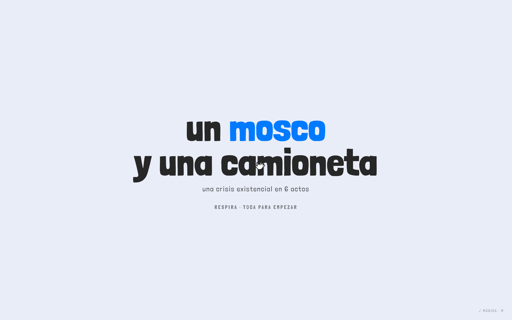

<div align="center">

# 🪰 Un moustique et une camionnette

### *une crise existentielle en 6 actes*

**[▶ Jouer en ligne](https://jorge-polanco-roque.github.io/el-mosco/)**

<br>



**Une histoire interactive tendre et brutale.** Une esthétique kawaii pastel comme cheval de Troie de l'abîme.
On progresse en relevant des défis — chacun vous fait *ressentir* entre vos mains une étape de la crise.

<br>

[](https://threejs.org)
[](https://developer.mozilla.org/docs/Web/API/Web_Audio_API)
[]()
[](LICENSE)

<br>

**🌐 Lire dans votre langue**

[English](README.md) · [Español](README.es.md) · [Português](README.pt.md) · [日本語](README.ja.md) · **Français** · [中文](README.zh.md)

</div>

---

> *Un instant avant, il bourdonnait. Un instant après : rien. L'univers n'a pas cligné des yeux.*

Un moustique traverse une route sans raison. Une camionnette passe. Le moustique cesse d'exister.
Cette microseconde — une mort absolue, absurde, sans témoin ni sens — fait détoner la
question que nous portons tous : **si cette vie n'a rien signifié, qu'est-ce qui rend la mienne différente ?**

Ce projet *est* cette réflexion, transformée en jeu. La tendresse de l'art porte le poids
pour que le texte n'ait pas à crier. **Le contraste est l'œuvre.**

---

## 🎭 Les six actes

Chaque défi incarne son idée *dans la mécanique* — le sens n'est pas expliqué, il se joue.

| # | Acte | Défi | La vérité qui atterrit |
|:-:|------|------|------------------------|
| 0 | **Le détonateur** | Sauve le moustique avant l'arrivée de la lumière | Impossible par conception. *« Et si tu étais le moustique ? »* |
| 1 | **L'insignifiance** | Trouve-*toi* parmi des centaines de points identiques | *« Aucun n'était spécial. Toi non plus. Et pourtant, te voilà, encore à regarder. »* |
| 2 | **L'absurde** | Pousse le rocher au sommet (il redescend toujours) | Camus : *« La lutte elle-même vers les sommets suffit à remplir un cœur. »* |
| 3 | **Le vertige de la liberté** | Choisis une porte — les autres disparaissent à jamais | *« Chaque oui est mille non. C'est cela, vivre. »* |
| 4 | **L'être-pour-la-mort** | Maintiens-le en vie (il s'éteint plus vite que tu ne peux le soutenir) | Heidegger : *« La mort n'est pas l'ennemie. C'est le cadre. »* |
| 5 | **La révolte** | Construis quelque chose — laisse ta marque | *« Le sens ne se trouve pas. Il se fabrique. »* → **« Il faut imaginer le moustique heureux. »** |

---

## ✨ Fonctionnalités

- **Esthétique tendre-brutale** — blobs pastel flottants, contours de BD, curseur en forme de main, 3D cel-shadée.
- **Six mécaniques interactives** — chaque acte est un mini-jeu symbolique différent.
- **Bande-son chiptune adaptative** — synthétisée en direct en La mineur. Un filtre passe-bas
  se referme à mesure que l'on descend : lumineux au début, étouffé dans *la mort*, lumineux à nouveau dans *la révolte*.
- **Sound design réactif** — le **zap** du moustique, des **risers** de tension à chaque transition
  et des **SFX de sélection aléatoires** pour que rien ne se répète.
- **Zéro build, zéro asset, zéro pistage** — un unique fichier HTML autonome.

## 🎮 Commandes

| Entrée | Action |
|--------|--------|
| **Clic / tap** | Avancer · interagir · choisir |
| **Glisser** | Pousser le rocher (Acte 2) |
| **M** | Couper / activer la musique |
| **R** | Revivre — recommencer depuis la fin |

## 🛠️ Pile technique

- **[three.js](https://threejs.org)** (r160) — cel-shading avec `MeshToonMaterial`, contours de BD par coque inversée.
- **Web Audio API** — un petit moteur chiptune en direct (oscillateurs, filtres, SFX procéduraux). Aucun fichier audio.
- **JS + HTML/CSS vanilla** — une machine à états en un seul fichier. Sans framework, sans bundler.

## 🚀 Exécuter en local

Aucune étape de build. N'importe quel serveur statique fonctionne :

```bash
git clone https://github.com/Jorge-Polanco-Roque/el-mosco.git
cd el-mosco
python3 -m http.server 8000
# ouvrez http://localhost:8000
```

> La musique démarre au premier clic (politique d'autoplay des navigateurs).

## 📁 Structure du projet

```
el-mosco/
├── index.html          # ← l'expérience (6 actes, musique, SFX)
├── demo/
│   └── toy-world.html  # le bac à sable ludique dont elle est née
├── docs/
│   └── CONCEPT.md       # document de conception artistique et technique
└── README*.md           # ceci, en 6 langues
```

## 🌱 Origine et crédits

- **Style visuel** rétro-conçu à partir du merveilleux [ketakuma.com](https://ketakuma.com)
  avec [skillui](https://www.npmjs.com/package/skillui) (extraction statique de tokens de design).
  C'est une *réinterprétation du style*, non une copie d'assets.
- **Philosophie** dans les marges : Albert Camus (*Le Mythe de Sisyphe*), Martin Heidegger
  (*l'être-pour-la-mort*), Søren Kierkegaard et Jean-Paul Sartre (le vertige de la liberté).
- **Police**: [Londrina Solid](https://fonts.google.com/specimen/Londrina+Solid).

## 📄 Licence

[MIT](LICENSE) — faites-en quelque chose. C'est tout le propos de l'Acte 5.

<div align="center">
<br>

*Le sens ne se trouve pas. Il se fabrique.*

**Il faut imaginer le moustique heureux — et toi aussi.**

</div>
